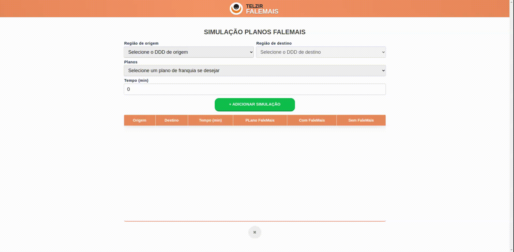

# Desafio LOL Design - telzir

Repositórios: [Frontend](https://github.com/fonsecaBarreto/loldesign-telzir-web-challenge) | [Backend](https://github.com/fonsecaBarreto/loldesign-telzir-api-challenge)

## Do Desafio:
A empresa de telefonia Telzir, especializada em chamadas de longa distância nacional, vai colocar
um novo produto no mercado chamado FaleMais.
Normalmente um cliente Telzir pode fazer uma chamada de uma cidade para outra pagando uma
tarifa fixa por minuto, com o preço sendo pré-definido em uma lista com os códigos DDDs de
origem e destino:

  Com o novo produto FaleMais da Telzir o cliente adquire um plano e pode falar de graça até
um determinado tempo (em minutos) e só paga os minutos excedentes. Os minutos excedentes
tem um acréscimo de 10% sobre a tarifa normal do minuto. Os planos são FaleMais 30 (30
minutos), FaleMais 60 (60 minutos) e FaleMais 120 (120 minutos).

  A Telzir, preocupada com a transparência junto aos seus clientes, quer disponibilizar uma
página na web onde o cliente pode calcular o valor da ligação. Ali, o cliente pode escolher os
códigos das cidades de origem e destino, o tempo da ligação em minutos e escolher qual o
plano FaleMais. O sistema deve mostrar dois valores: (1) o valor da ligação com o plano e (2)
sem o plano. O custo inicial de aquisição do plano deve ser desconsiderado para este problema.

## Como executar :

<pre><code>$ docker-compose -f docker-compose.stage.yml up
</code></pre>

Serão executados os seguintes serviços :
- 1. Será instanciado um Banco de dados postgreSQL
- 3. Rest api (NestJs)
  - 3.1 Atualização dos esquemas para o banco de dados conforme o sql encontrado em ".nest/prisma/migrations"
  - 3.2 Seeds iniciais serão injetadas
  - 3.3 Aplicação inicializada
- 4. Web SPA(React) 

### Back-end rodando em:
  <http://localhost:9000>

### Front-end rodando em:
  <http://localhost:8080>

## Documentação :

Swagger em: 
<pre><code>$ localhost:9000/api
</code></pre>

Diagrama de classes:

